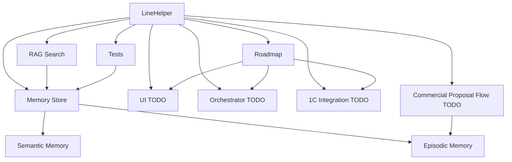

# LineHelper

## Кратко

LineHelper - локальный AI-агент для компании Serviceline. По текущему состоянию репозитория реализован не весь агент, а его базовый слой памяти: [[05_Memory_System|Memory Store MVP]] на SQLite + FTS5. UI, оркестратор, загрузка документов, embeddings, интеграция с 1С и полноценный flow коммерческого предложения пока отмечены как план или TODO, потому что соответствующих модулей в коде нет.

## Быстрый вход в проект

1. Начать с [[01_Project_Overview]]: зачем нужен проект и где границы MVP.
2. Перейти к [[02_Architecture_Map]]: какие компоненты уже есть, а какие только планируются.
3. Проверить фактический код через [[03_Module_Map]].
4. Разобрать текущий рабочий центр проекта в [[05_Memory_System]].
5. Открыть [[11_Testing_Map]] и [[12_Config_and_Environment]], чтобы понять запуск и проверки.

## Карта для разработчика

| Что понять | Куда идти | Фактическая опора в проекте |
| --- | --- | --- |
| Основной код | [[05_Memory_System]], [[03_Module_Map]] | [memory_store.py](../../linehelper/memory/memory_store.py) |
| SQL-схема | [[05_Memory_System]] | [schema.py](../../linehelper/memory/schema.py) |
| Инициализация БД | [[12_Config_and_Environment]] | [init_memory_db.py](../../scripts/init_memory_db.py) |
| Тесты | [[11_Testing_Map]] | [test_memory_store.py](../../scripts/tests/test_memory_store.py) |
| Smoke-проверка | [[11_Testing_Map]] | [smoke_test_semantic_memory.py](../../scripts/smoke_test_semantic_memory.py) |
| История решений | [[16_Decision_Log]] | Git log и текущая структура |

## Карта для руководителя

| Вопрос | Заметка |
| --- | --- |
| Что уже готово | [[01_Project_Overview]], [[05_Memory_System]] |
| Что пока не готово | [[14_Tech_Debt]], [[15_Roadmap]] |
| Почему архитектура такая | [[16_Decision_Log]], [[02_Architecture_Map]] |
| Где риски по данным | [[06_1C_Integration]], [[09_Document_Loading]], [[10_Commercial_Proposal_Flow]] |
| Что спросить у владельца | [[18_Open_Questions]] |

## Текущий статус MVP

| Область | Статус | Комментарий |
| --- | --- | --- |
| Memory Store | частично готово | Есть SQLite, FTS5, `semantic` и `episodic` |
| Semantic memory | storage готов частично | Нет загрузчика документов и chunking |
| Episodic memory | storage готов частично | Есть `save_experience()` и TTL, нет пользовательского подтверждения |
| RAG | частично | Есть FTS5, нет embeddings/hybrid/rerank |
| 1С | TODO | Нет интеграционного кода |
| UI | TODO | Нет интерфейса |
| Оркестратор | TODO | Нет слоя intent/tool routing |
| КП flow | TODO | Есть только нижний метод сохранения опыта |
| Тесты | частично | Есть pytest для MemoryStore и ручной smoke-test |

## Главные архитектурные решения

- [[16_Decision_Log#ADR-001 SQLite как MVP-хранилище памяти|ADR-001]]: SQLite + FTS5 как локальное MVP-хранилище.
- [[16_Decision_Log#ADR-002 Разделение semantic и episodic memory|ADR-002]]: разделение стабильных знаний и подтвержденного опыта.
- [[16_Decision_Log#ADR-003 1С как источник актуальных данных а не память|ADR-003]]: 1С не должна автоматически становиться памятью.
- [[16_Decision_Log#ADR-004 TTL для episodic memory|ADR-004]]: episodic-записи имеют срок жизни.
- [[16_Decision_Log#ADR-005 Возможная миграция на vector DB|ADR-005]]: vector DB рассматривается как будущая гипотеза.

## Главные техдолги

- [[14_Tech_Debt#TD-001 Нет слоя загрузки документов|TD-001]]: нет загрузчика документов.
- [[14_Tech_Debt#TD-002 Поиск только FTS5 без embeddings|TD-002]]: поиск пока только FTS5.
- [[14_Tech_Debt#TD-003 Нет оркестратора и границ бизнес-логики|TD-003]]: нет application/service слоя.
- [[14_Tech_Debt#TD-004 Нет контракта интеграции с 1С|TD-004]]: 1С пока не подключена.
- [[14_Tech_Debt#TD-005 Нет политики безопасного сохранения памяти|TD-005]]: нет формализованной data policy.

## Что читать первым

Для нового разработчика:

1. [[19_Onboarding_For_New_Developer]]
2. [[03_Module_Map]]
3. [[05_Memory_System]]
4. [[11_Testing_Map]]
5. [[14_Tech_Debt]]

Для продуктового или технического руководителя:

1. [[01_Project_Overview]]
2. [[20_Project_Graph]]
3. [[15_Roadmap]]
4. [[16_Decision_Log]]
5. [[18_Open_Questions]]

## Верхнеуровневый граф

## Все ключевые заметки

| Заметка | Роль в графе |
| --- | --- |
| [[01_Project_Overview]] | бизнес-смысл и границы |
| [[02_Architecture_Map]] | архитектурная карта |
| [[03_Module_Map]] | фактические файлы и зависимости |
| [[04_Data_Flow]] | текущие и целевые потоки данных |
| [[05_Memory_System]] | центральная реализованная подсистема |
| [[06_1C_Integration]] | будущая интеграция с 1С |
| [[07_RAG_Search]] | поиск и будущий RAG |
| [[08_UI_and_Orchestrator]] | будущий UI и orchestration |
| [[09_Document_Loading]] | будущая загрузка документов |
| [[10_Commercial_Proposal_Flow]] | будущий flow КП |
| [[11_Testing_Map]] | тесты и smoke-проверки |
| [[12_Config_and_Environment]] | запуск и окружение |
| [[13_Version_History]] | история Git и плановая шкала |
| [[14_Tech_Debt]] | реестр рисков и долгов |
| [[15_Roadmap]] | путь к MVP |
| [[16_Decision_Log]] | архитектурные решения |
| [[17_Glossary]] | словарь терминов |
| [[18_Open_Questions]] | вопросы к владельцу |
| [[19_Onboarding_For_New_Developer]] | вход нового разработчика |
| [[20_Project_Graph]] | несколько уровней графа |

## Обслуживание карты

- Правила связности: [[LINKING_POLICY]].
- Последний аудит графа: [[GRAPH_AUDIT]].

## Связанные заметки

- Родительская тема: [[01_Project_Overview]]
- Архитектура: [[02_Architecture_Map]]
- Практический уровень: [[03_Module_Map]]
- Риски и план: [[14_Tech_Debt]], [[15_Roadmap]]
- Решения: [[16_Decision_Log]]
