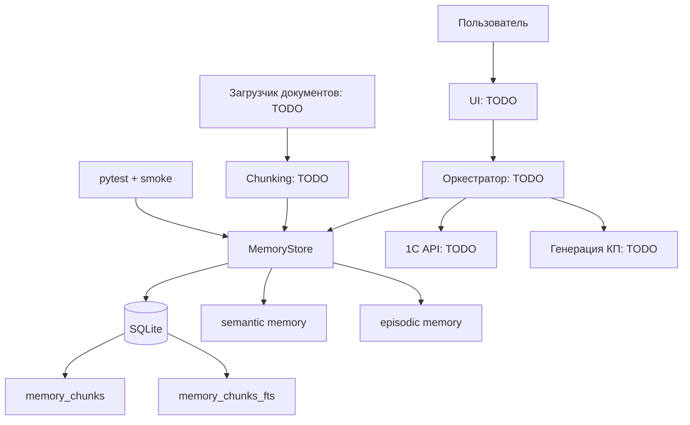

# Архитектурная карта

Фактическая архитектура сейчас минимальна: Python-пакет `linehelper.memory` хранит и ищет текстовые фрагменты в SQLite + FTS5. Остальные блоки ниже являются целевой архитектурой из README и требований к проекту, пока без реализации в коде.

## Компоненты

| Компонент | Статус | Факты |
| --- | --- | --- |
| UI | TODO | В коде нет UI-модулей |
| Оркестратор | TODO | В коде нет слоя intent/tool routing |
| Memory Store | готово частично | `MemoryStore` в `linehelper/memory/memory_store.py` |
| Semantic memory | готово как namespace | `namespace="semantic"` |
| Episodic memory | готово как namespace | `namespace="episodic"`, TTL через `expires_at` |
| RAG-поиск | частично | Есть FTS5, нет embeddings/hybrid/rerank |
| Интеграция с 1С | TODO | Нет модулей/API-клиента |
| Генерация КП | TODO | Есть только `save_experience()` для подтвержденного опыта |
| Загрузка документов | TODO | В `requirements.txt` есть `pymupdf` и `python-docx`, но загрузчика нет |
| Конфигурация | частично | `.gitignore`, `requirements.txt`, дефолтный путь к БД |
| Тесты | частично | pytest для MemoryStore и ручной smoke-test |

## Диаграмма

## Ключевая архитектурная идея

SQLite + FTS5 выбран как простой локальный слой памяти для MVP. Это позволяет проверять модель данных и правила сохранения знаний до появления полноценного RAG-контура, embeddings и внешней vector DB. См. [[16_Decision_Log]].

## Что важно не смешивать

- Memory Store не должен знать бизнес-логику КП.
- 1С не должна быть памятью: она источник актуальных операционных данных.
- Semantic memory не должна хранить неподтвержденные кейсы.
- Episodic memory должна хранить только подтвержденный опыт и иметь срок жизни.
- UI не должен напрямую обходить правила сохранения памяти.

## Связанные заметки

- Родительская тема: [[00_INDEX]]
- Фактические модули: [[03_Module_Map]]
- Потоки данных: [[04_Data_Flow]]
- Текущее ядро: [[05_Memory_System]]
- Архитектурные решения: [[16_Decision_Log]]
