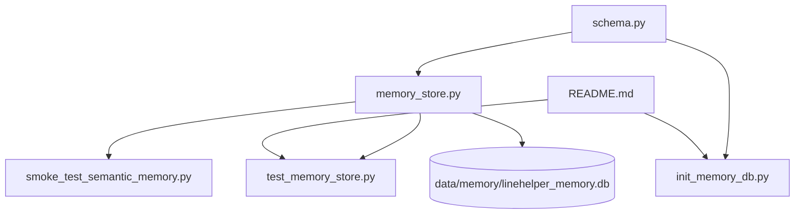

# Карта модулей

## Фактическое дерево проекта

```text
data/
  memory/
  raw_docs/
linehelper/
  __init__.py
  memory/
    __init__.py
    schema.py
    memory_store.py
scripts/
  init_memory_db.py
  smoke_test_semantic_memory.py
  tests/
    test_memory_store.py
requirements.txt
README.md
```

## Модули

| Путь | Назначение | Содержит | Зависит от | Используется где | Статус |
| --- | --- | --- | --- | --- | --- |
| `linehelper/__init__.py` | Корневой пакет | docstring | нет | импорт пакета | готово |
| `linehelper/memory/__init__.py` | Пакет памяти | docstring | нет | импорт `linehelper.memory` | готово |
| `linehelper/memory/schema.py` | SQL-схема памяти | `MEMORY_SCHEMA_SQL` | SQLite FTS5 | `MemoryStore`, init-скрипт | готово частично |
| `linehelper/memory/memory_store.py` | API локальной памяти | `MemoryStore`, validators, JSON metadata helpers | `sqlite3`, `json`, `datetime`, `pathlib`, `schema.py` | тесты, smoke, будущий оркестратор | частично |
| `scripts/init_memory_db.py` | Инициализация БД | `main()`, `DB_PATH` | `sqlite3`, `schema.py` | ручной запуск | готово |
| `scripts/smoke_test_semantic_memory.py` | Ручной smoke-test | `main()` | `MemoryStore` | ручная диагностика | частично |
| `scripts/tests/test_memory_store.py` | Автотесты MemoryStore | pytest-тесты | `pytest`, `MemoryStore` | CI/TODO, локальный запуск | готово частично |
| `requirements.txt` | Зависимости | `pymupdf`, `python-docx`, `pytest` | pip | установка окружения | частично |
| `README.md` | Главная документация | описание MVP, запуск, тесты | нет | разработчики | частично |

## Внутренности `MemoryStore`

| Элемент | Назначение | Статус |
| --- | --- | --- |
| `ALLOWED_NAMESPACES` | Ограничивает namespace до `semantic` и `episodic` | готово |
| `_utc_now_iso()` | UTC timestamp для записей | готово |
| `_validate_namespace()` | Защита от неверного namespace | готово |
| `_validate_limit()` | Защита от невалидного лимита поиска | готово |
| `_metadata_to_json()` / `_metadata_from_json()` | Сериализация metadata | готово |
| `ensure_schema()` | Создает директорию БД и SQL-схему | готово |
| `add_chunk()` | Добавляет текстовый chunk | готово |
| `save_experience()` | Сохраняет подтвержденный опыт в episodic memory | готово частично |
| `search_fts()` | Ищет через FTS5 | готово частично |
| `delete_chunk()` | Удаляет chunk | готово |
| `expire_old_episodes()` | Удаляет устаревшие episodic-записи | готово |

## Связи



## Связанные заметки

- Родительская тема: [[02_Architecture_Map]]
- Центральная подсистема: [[05_Memory_System]]
- Проверки: [[11_Testing_Map]]
- Решения: [[16_Decision_Log]]
- Техдолги по модулям: [[14_Tech_Debt]]
