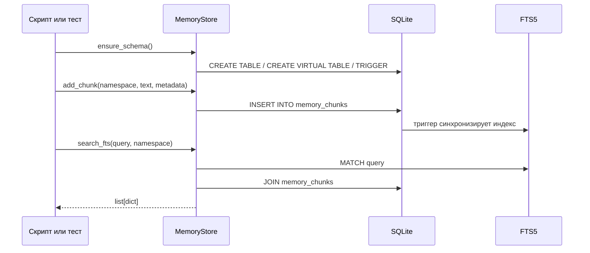
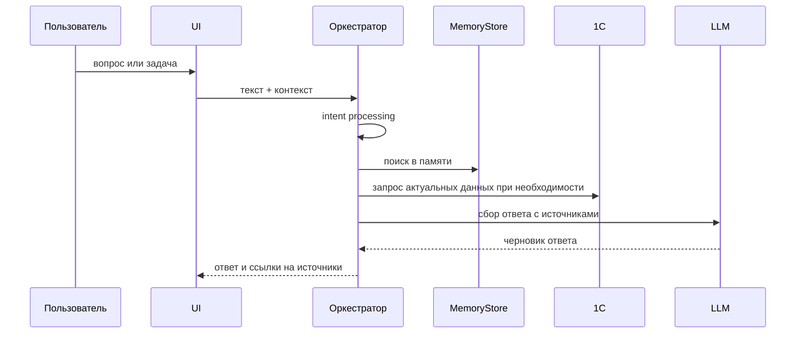
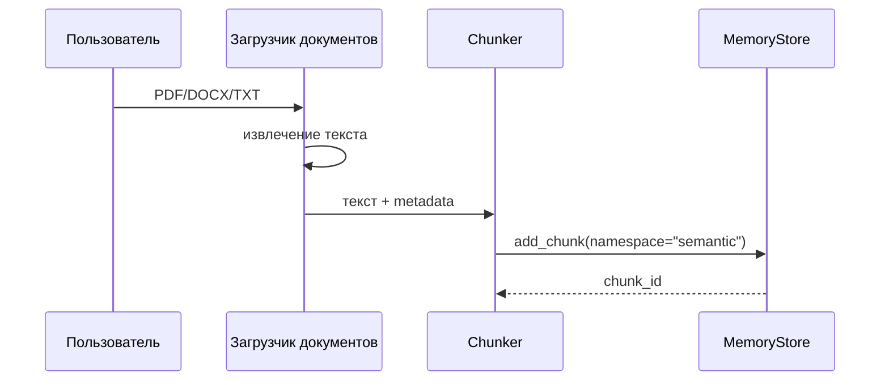
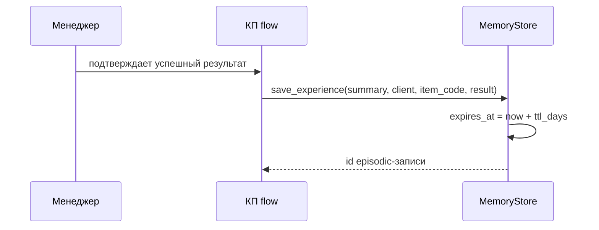
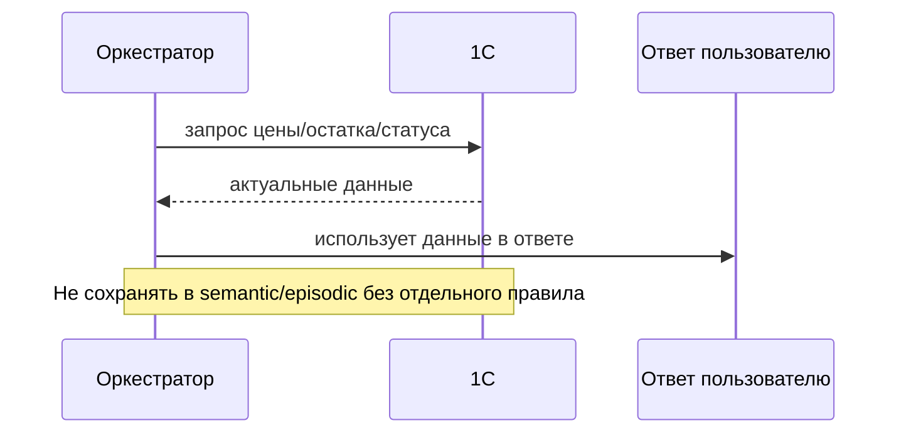

# Потоки данных

## Текущий реализованный поток: запись и поиск chunk

## Запрос пользователя -> ответ

Текущий статус: TODO. В коде нет UI, intent processing, LLM и оркестратора.

Целевой поток:

## Загрузка документа -> semantic memory

Текущий статус: TODO. В `requirements.txt` есть `pymupdf` и `python-docx`, но модулей загрузки, парсинга и chunking нет.

## Успешное КП -> episodic memory

Фактически реализован метод `save_experience()`, но нет полноценного КП-flow и подтверждения пользователем.

## Запрос к 1С -> оперативные данные

Текущий статус: TODO. Важное правило: данные из 1С считаются актуальными операционными данными, а не памятью.

