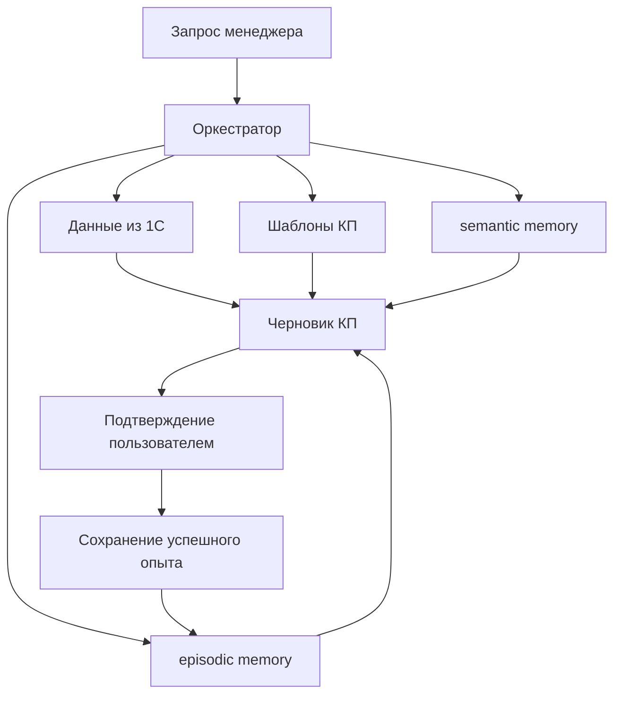

# Сценарий КП

Полноценный flow коммерческого предложения в коде не реализован. Есть только метод `MemoryStore.save_experience()`, который может сохранять подтвержденный практический опыт в `episodic`.

## Целевой сценарий

## Использование источников

| Источник | Роль | Статус |
| --- | --- | --- |
| 1С | актуальные цены, остатки, клиентские данные | TODO |
| Шаблоны | структура КП | TODO |
| Semantic memory | стабильные правила и знания | storage есть, загрузка TODO |
| Episodic memory | подтвержденный прошлый опыт | storage есть частично |
| LLM | формирование текста | TODO |

## Подтверждение пользователем

Перед сохранением опыта пользователь должен явно подтвердить, что результат полезен и корректен. Только после этого допустим вызов `save_experience()`.

## Что нельзя сохранять без подтверждения

- Черновик КП.
- Непроверенные цены и сроки.
- Персональные данные клиента.
- Сырые данные из 1С.
- Коммерческие условия, если нет политики хранения.
- Внутренние комментарии менеджера.

## Текущая реализация `save_experience()`

Метод принимает:

- `summary`;
- `client`;
- `item_code`;
- `result`;
- `title`;
- `ttl_days`;
- `confidence`;
- `priority`;
- `metadata`.

Он сохраняет запись как:

- `namespace="episodic"`;
- `doc_type="proposal_experience"`;
- `source="confirmed_experience"`;
- `expires_at = now + ttl_days`.

## Открытые вопросы

- Что считается успешным КП?
- Кто имеет право подтверждать опыт?
- Можно ли хранить название клиента в metadata?
- Как анонимизировать кейсы?
- Как удалять опыт по запросу?

