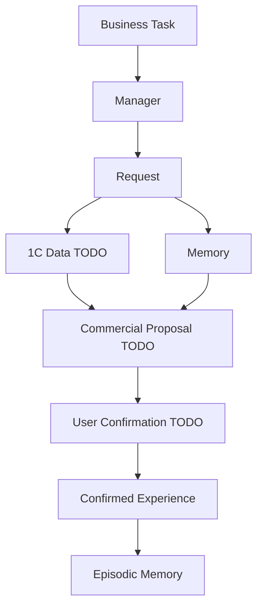
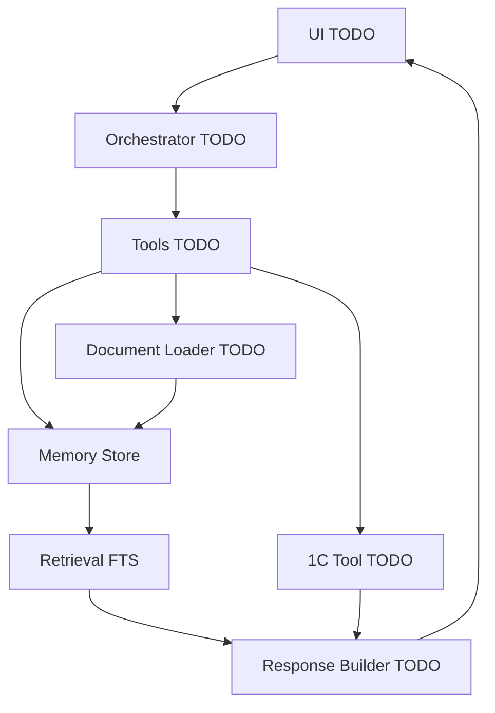
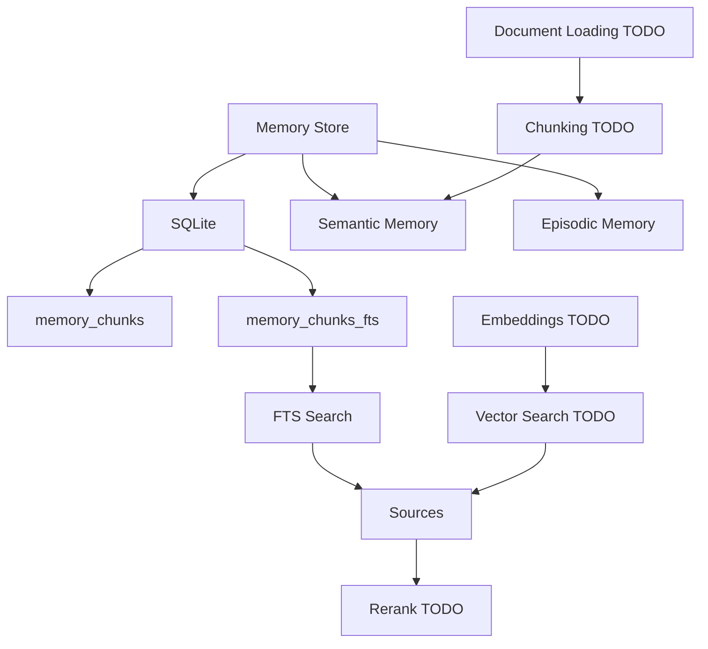
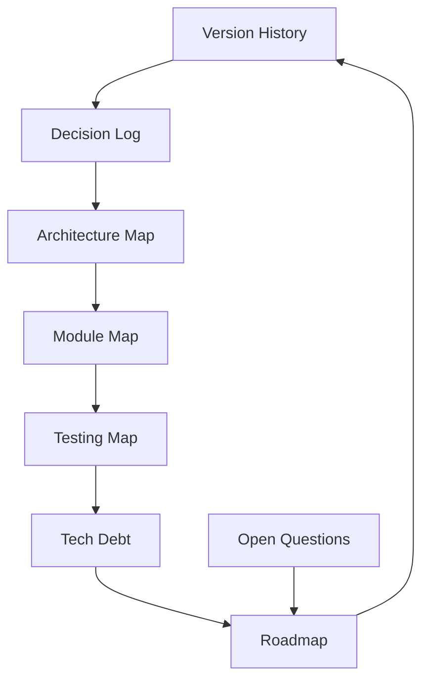

# Граф проекта

## Кратко

Эта заметка не дублирует [[00_INDEX]], а показывает LineHelper как несколько связанных графов. Часть узлов подтверждена кодом, часть помечена как TODO или гипотеза. Главный фактический центр сейчас - [[05_Memory_System|Memory Store]].

## Уровень 1. Бизнес-граф

Схема показывает целевой бизнес-смысл: менеджер делает запрос, получает данные и готовит КП, а подтвержденный успешный опыт может вернуться в episodic memory. Интеграция с 1С и КП-flow пока не подтверждены кодом.

## Уровень 2. Архитектурный граф

Схема отделяет реализованный слой памяти от будущих слоев UI, orchestrator, tools и response builder. Сейчас в коде есть только Memory Store, schema, scripts и tests.

## Уровень 3. Граф памяти

Схема показывает фактическую и будущую структуру поиска. SQLite, FTS5, semantic и episodic namespace подтверждены кодом. Embeddings и rerank пока планируются.

## Уровень 4. Граф разработки

Схема связывает историю, решения, техдолг, тесты и roadmap. Она нужна, чтобы каждое изменение имело место в карте: факт в версии, причина в ADR, риск в техдолге, следующий шаг в roadmap.

## Ключевые узлы

| Узел | Где описан | Фактическая опора |
| --- | --- | --- |
| Memory Store | [[05_Memory_System]] | [memory_store.py](../../linehelper/memory/memory_store.py) |
| SQL schema | [[05_Memory_System]], [[03_Module_Map]] | [schema.py](../../linehelper/memory/schema.py) |
| FTS search | [[07_RAG_Search]] | `MemoryStore.search_fts()` |
| Tests | [[11_Testing_Map]] | [test_memory_store.py](../../scripts/tests/test_memory_store.py) |
| Roadmap | [[15_Roadmap]] | планы, не релиз |
| Tech debt | [[14_Tech_Debt]] | анализ текущих пробелов |

## Связи бизнес-сценариев и кода

| Сценарий | Текущий код | Статус |
| --- | --- | --- |
| Найти знание | `search_fts()` | частично |
| Добавить знание | `add_chunk(namespace="semantic")` | частично |
| Сохранить опыт КП | `save_experience()` | частично |
| Удалить устаревший опыт | `expire_old_episodes()` | частично |
| Загрузить документ | нет | TODO |
| Получить данные из 1С | нет | TODO |
| Сформировать КП | нет | TODO |
| Ответить пользователю через UI | нет | TODO |

## Связанные заметки

- Родительская тема: [[00_INDEX]]
- Архитектура: [[02_Architecture_Map]]
- Модули: [[03_Module_Map]]
- Данные и память: [[04_Data_Flow]], [[05_Memory_System]]
- Риски и развитие: [[14_Tech_Debt]], [[15_Roadmap]]
